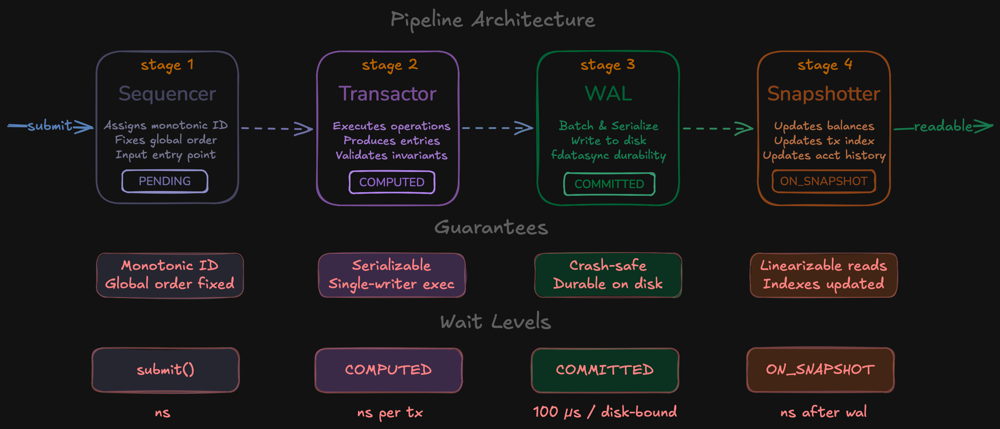
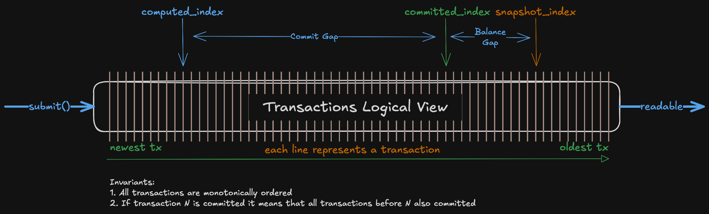
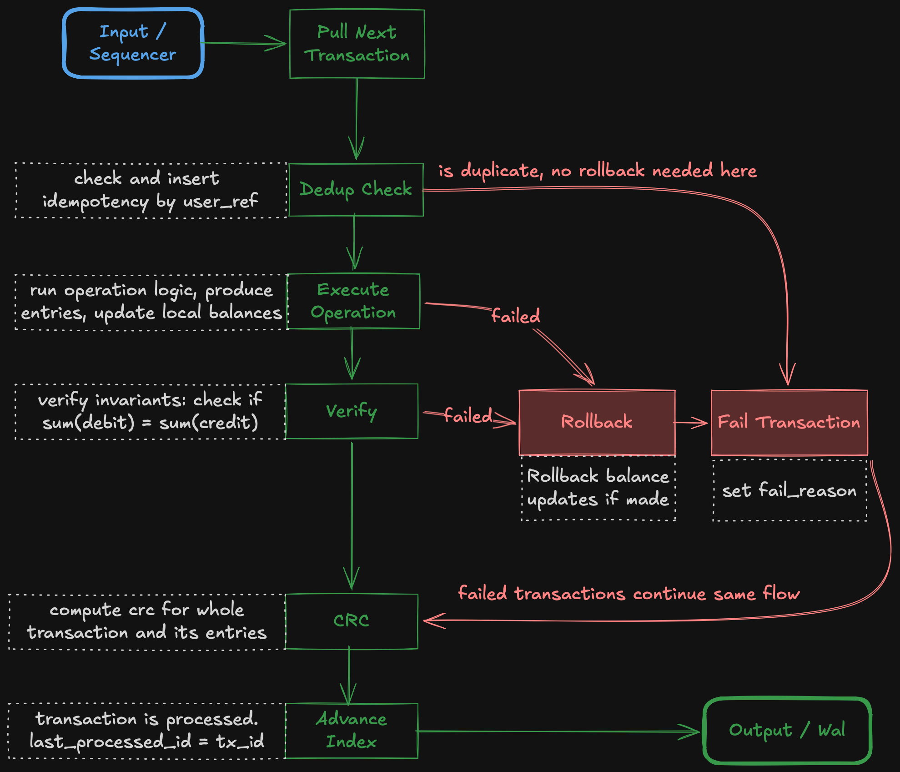
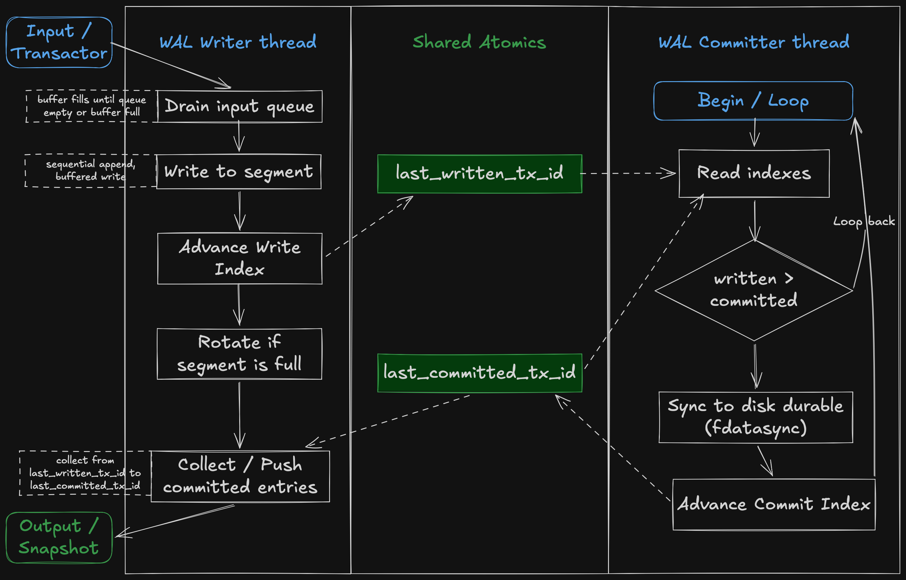
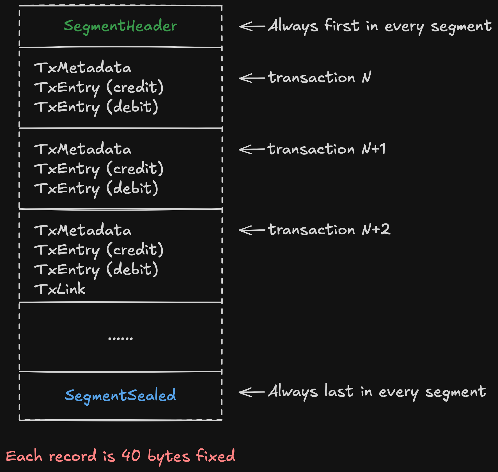
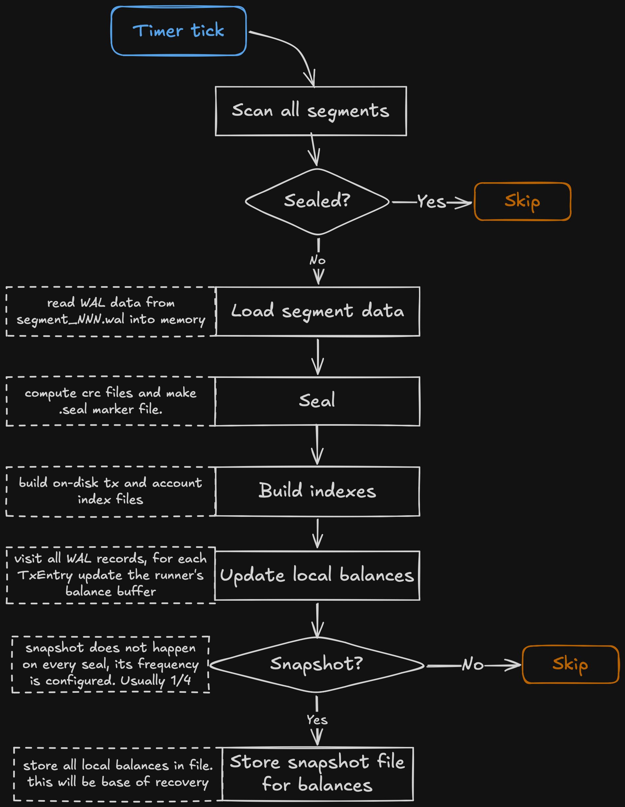
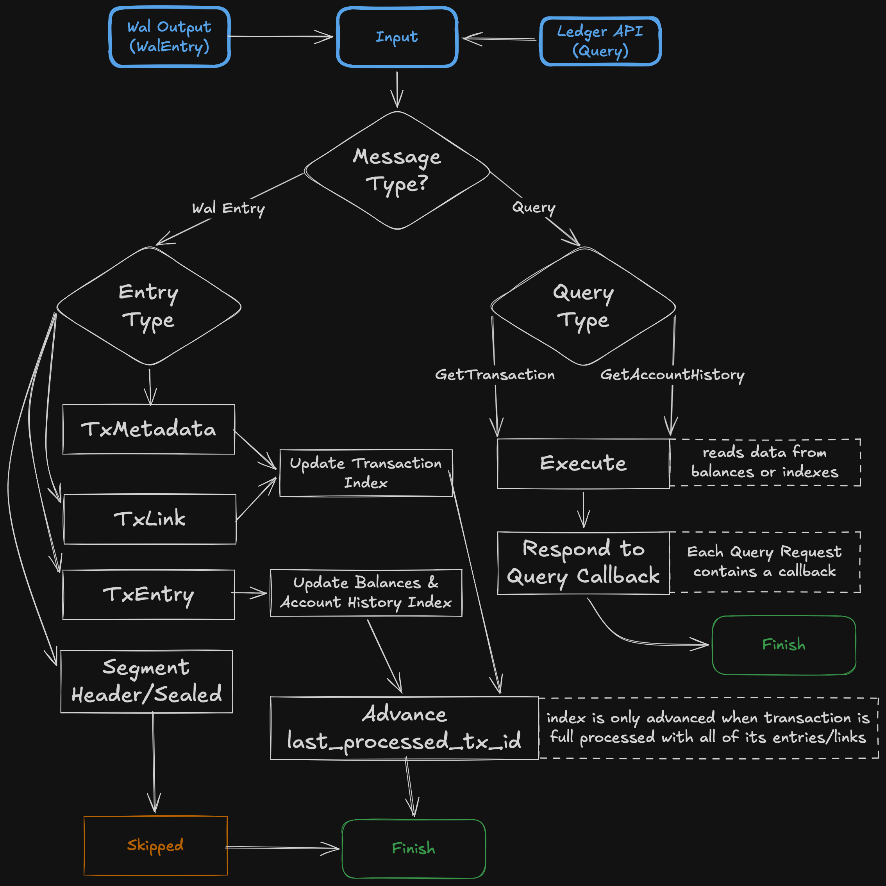

# Architecture

This document explains the design of roda-ledger — what each part does, why it exists, and the reasoning behind key tradeoffs. Implementation details (data structures, binary formats, lock mechanics) are in [Internals](./04-internals.md).

If you haven't already, read [Concepts](./01-concepts.md) first — it defines the terminology and guarantees this document builds on.

---

## Design philosophy

roda-ledger is built around two problems that pull in opposite directions: **correctness** and **throughput**.

Correctness requires strict ordering and a single source of truth — concurrent writers create races, conflicts, and partial states that are catastrophic in a financial system. Throughput requires parallelism — sequential processing leaves hardware idle.

The solution is a **staged pipeline**. Each stage does one job on its own thread, communicating with adjacent stages through lock-free queues. There is no shared mutable state between stages.

The key insight: **parallelism around execution, not within it.** The Transactor executes one transaction at a time — this is the source of all correctness guarantees. But while the Transactor executes transaction N, the WAL is persisting N-1, and the Snapshotter is making N-2 visible to readers. All stages run concurrently without ever coordinating.

---

## Pipeline overview

A transaction moves through four stages, each adding a guarantee:

| Stage | Guarantee | Status |
|---|---|---|
| Sequencer | Monotonic ID, permanent global order | `PENDING` |
| Transactor | Executed, serializable, result known | `COMPUTED` |
| WAL | Durable on disk, crash-safe | `COMMITTED` |
| Snapshotter | Balances and indexes visible | `ON_SNAPSHOT` |

The caller chooses which stage to wait for — see [API](./02-api.md) for wait level details.

---

## Transaction logical view

Every transaction occupies a fixed position in a globally ordered sequence. Three pipeline indexes divide that sequence into zones at any given moment:

- **`compute_index`** — the furthest transaction the Transactor has executed. Everything to its right is accepted, in memory, serializable. Not yet durable.
- **`commit_index`** — the furthest transaction flushed to disk. Everything to its right is durable and crash-safe. The **Commit Gap** between `computed_index` and `committed_index` represents transactions that would be lost on a crash — bounded by the WAL's batch flush cycle (~100s µs).
- **`snapshot_index`** — the furthest transaction visible to `get_balance`. Everything to its right is readable and linearizable. The **Balance Gap** between `committed_index` and `snapshot_index` is typically nanoseconds.

Two invariants hold at all times:

1. All transactions are monotonically ordered — no gaps, no reordering.
2. If transaction N is committed, all transactions before N are also committed. The indexes only move forward.

These invariants are what make per-call wait levels meaningful. When you call `submit_wait(wal)`, you are waiting for `committed_index` to pass your transaction ID — and you know with certainty that everything before it is also durable.

---

## The Sequencer

The Sequencer is the entry point. It assigns a unique, monotonically increasing ID to every transaction and fixes its position in the global order. This decision is permanent — no later stage can change it.

The Sequencer has no dedicated thread. It runs on the caller's thread at submit time — nothing more than an atomic increment and a queue push.

---

## The Transactor

The Transactor is a single-threaded, deterministic execution engine. It processes one transaction at a time, in strict sequence order.

**Why single-threaded?** A single writer eliminates races and conflicts entirely. Correctness is guaranteed by construction, not by coordination.

For each transaction the Transactor: checks deduplication by `user_ref`, executes the operation (producing credit/debit entries and updating the balance cache live), verifies invariants (zero-sum), computes a CRC over the full transaction, then advances its processed index and sends to the WAL queue. Failed transactions — duplicates, execution errors, invariant violations — follow the same path to the WAL for audit purposes.

The balance cache always reflects the latest state. This is why the write path is always linearizable — the Transactor never makes a decision based on stale data.

---

## The WAL

The WAL stage makes transactions durable. A transaction executed by the Transactor exists only in memory — the WAL writes it to disk before it can be considered safe.

The WAL runs as **two concurrent threads** communicating through shared atomics:

- **WAL Writer** — drains the input queue into a buffer, writes to the active segment file, advances `last_written_tx_id`, rotates segments when full, and pushes committed entries to the Snapshotter queue.
- **WAL Committer** — runs independently, calls `fdatasync` whenever `last_written_tx_id > last_committed_tx_id`, then advances `last_committed_tx_id`.

The Writer never blocks waiting for `fdatasync` — it continues writing while the Committer syncs. Entries only flow to the Snapshotter after the Committer confirms durability. This decoupling is why the WAL sustains high write throughput despite the inherent latency of `fdatasync` (~100s µs, disk-bound).

The WAL is **segmented** — divided into files of configurable size. When a segment is full, the Writer rotates to a new one. Sealed segments are complete, consistent units used for recovery.

---

## Segment lifecycle

A segment moves through three states:

| State | File on disk | Description |
|---|---|---|
| `ACTIVE` | `wal.bin` | Currently being written. One at a time. |
| `CLOSED` | `segment_NNN.wal` | WAL Writer rotated away. Immutable, awaiting Seal. |
| `SEALED` | `segment_NNN.wal` + `.crc` + `.seal` | Verified, safe for recovery. May have snapshot. |

**ACTIVE → CLOSED:** size threshold hit → WAL Writer writes `SegmentSealed` entry, `fdatasync`, renames `wal.bin` to `segment_NNN.wal`, opens new `wal.bin`.

**CLOSED → SEALED:** Seal process picks it up on a timer, computes CRC32, writes `.crc` and `.seal` sidecar files.

### Segment anatomy

Every WAL record is exactly **40 bytes** — fixed size, no variable-length scanning. This makes recovery fast and deterministic.

### Seal process

The Seal process runs on a configurable timer. For each unsealed segment it: loads the WAL data, seals it (CRC + sidecar files), builds on-disk tx and account indexes, updates its local balance buffer, and conditionally writes a snapshot file.

Snapshots are not written on every seal — only every `snapshot_frequency` segments (default: 2). The snapshot captures all non-zero balances at that point and is the base for recovery.

---

## The Snapshotter

The Snapshotter applies committed entries to the readable state — the balance cache, transaction index, and account history index.

**Why a separate stage?** The Transactor's balance cache is write-side truth, private and optimized for writes. The Snapshotter maintains read-side truth. Separating them means readers never block writers.

The Snapshotter processes a single input queue carrying two message types:

- **WalEntry** — updates the appropriate index or balance cache based on entry type. Once a full transaction is processed, `last_processed_tx_id` advances and `get_balance` reflects it.
- **QueryRequest** — executes inline against current state (`GetTransaction`, `GetAccountHistory`) and calls the response callback.

The Snapshotter does no computation — balances are pre-computed by the Transactor and stored in entries. The gap between `COMMITTED` and `ON_SNAPSHOT` is typically nanoseconds.

---

## Inter-stage communication

Stages communicate exclusively through **SPSC lock-free queues** — one producer, one consumer, no locks, no CAS contention. Each stage owns its data completely.

**Backpressure** propagates naturally: WAL pressure fills the Transactor-to-WAL queue, stalling the Transactor, which fills the Sequencer-to-Transactor queue, which eventually stalls `submit()`. No explicit flow control needed.

The wait strategy under backpressure is controlled by `pipeline_mode`: `low_latency` (spin forever), `balanced` (spin → yield → park), `low_cpu` (park quickly).

---

## Recovery

On startup, roda-ledger restores state automatically before accepting transactions:

1. Find the latest snapshot — gives all balances at a known transaction ID
2. Load those balances
3. Replay WAL segments that postdate the snapshot
4. Resume from the exact point where the ledger left off

Because every committed transaction is in the WAL, and the WAL is always replayed on recovery, **a committed transaction is never lost**. Recovery time is bounded by snapshot frequency — more frequent snapshots mean less WAL to replay.

---

## Design boundaries

**Single node.** All pipeline stages run on one machine. Raft-based multi-node replication is planned — the segmented, append-only WAL is a natural fit for log replication.

**Pre-allocated account space.** Balances are stored in a structure sized to `max_accounts`. O(1) reads and writes always, but memory is committed at startup — a capacity planning decision.

**Disk-bound durability throughput.** `fdatasync` latency determines `COMMITTED` throughput. On NVMe this is hundreds of µs per batch. `COMPUTED` throughput (in-memory only) reaches millions of transactions per second.

**Single-writer ceiling.** The Transactor is the upper bound on execution throughput. In practice the WAL is almost always the bottleneck — but on fast enough storage, the single-threaded Transactor becomes the limit.
